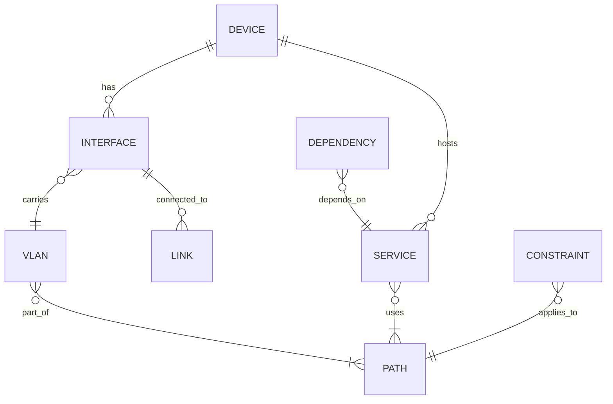
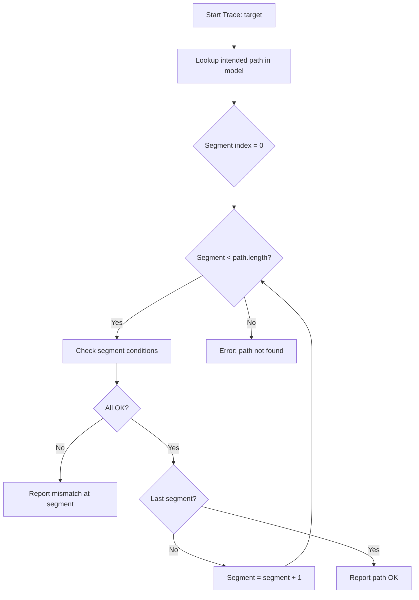
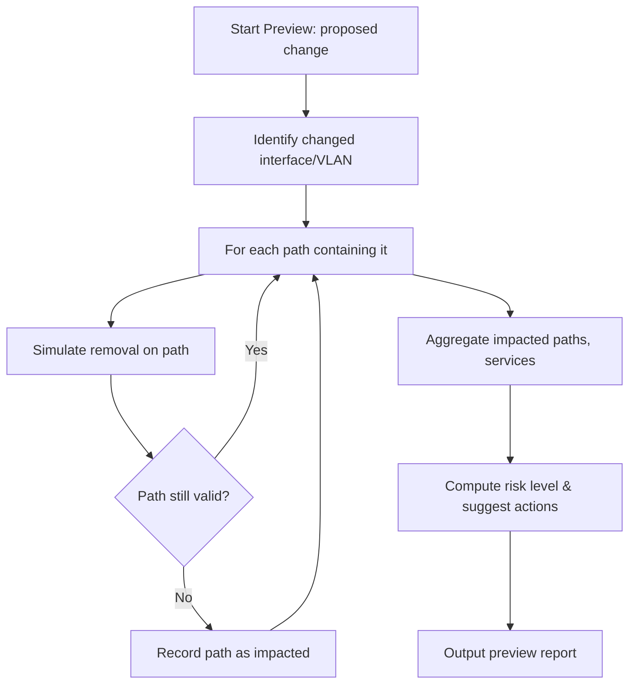
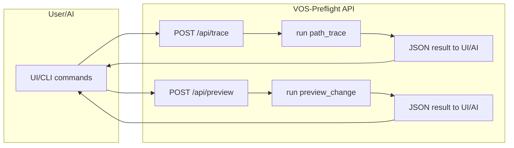

# VOS-Preflight: AI-Facing Network Intent & Diagnostics

**Executive Summary:** Modern networks struggle when changes are applied *ad hoc* – an AI (or human) fixes one break and inadvertently breaks another because global intent was never made explicit. Intent-based networking (IBN) aims to shift from low-level configuration to high-level goals【29†L60-L62】【36†L100-L108】. VOS-Preflight applies these ideas to a small-scale (homelab/SMB) context. It externalizes the network “contract” (devices, links, VLANs, services, constraints) into a structured JSON model and provides two primary modes: **(A) Path Trace** (diagnose where a path is broken) and **(B) Impact Preview** (predict what a proposed change would disrupt) before any execution. This approach forces any AI (or engineer) to query the model instead of guessing, closing the loop with live verification. It complements – rather than replaces – tools like NetBox or Docusaurus docs by focusing on *paths and constraints for planning*. Similar concepts appear in research and products: for example, Batfish verifies network config correctness【31†L8-L10】, and Cisco’s SD-Access/IBN continually adjusts toward business intent【36†L100-L108】. VOS-Preflight’s novelty is packaging a minimal, Git-backed “intent graph” plus reasoning engines (failure tracing and change-impact simulation) that an AI can call via APIs. The goal is not a full-blown new CMDB, but a **path-centric guardrail**: “If VLAN 254 must reach device X, where does it break?” and “If we drop VLAN 254 from this link, what else fails?” By making paths and dependencies explicit, both human operators and LLM-based automations can plan safely. 

## 1. Context and Goals

- **Problem:** In a dynamic multi-host network (Proxmox VMs, OPNsense firewall, managed switches, etc.), fixes often have hidden side effects. A fix to one VLAN or bridge can silently disrupt management or service connectivity elsewhere. Offloading to an AI worsens this: the AI optimizes locally without full knowledge, leading to ping-pong breakages. As one Cisco paper explains, IBN should continuously “monitor and adjust” network state to business intent【36†L100-L108】 – but here we need that on a tiny scale.  
- **Solution Vision:** Build an “intent graph” representing **what paths should exist** (e.g. management VLANs, service links, uplinks) and **what depends on them**. Then equip the system with two main capabilities:
  1. **Path-Tracing Diagnostics:** When a service fails (e.g. device X lost VLAN 254), automatically trace backwards through the graph and observed state to find the first mismatch. In other words, *“where did this expected path break?”*.  
  2. **Impact Simulation (Preflight):** Before making a change (e.g. “remove VLAN 254 from switch port P”), compute *“what other devices/services depend on that path?”* and flag risks. This lets us revise the plan or require manual steps.  

  These map to an **intent graph + verification engine** for both humans and AIs. An AI agent should be forced to answer: *“What should fail if I do this? And did it succeed?”* – rather than “Just push the change.”

- **Alignment with IBN:** In spirit, VOS-Preflight is intent-based: we express **business/operational intent** (“Management VLAN 254 must reach all hosts”) as first-class data, not code. The system then enforces and checks it. As a WWT blog notes, IBN *“shifts the conversation from configuration to outcome. That intent is then translated into network state, deployed, and – most importantly – continuously validated.”*【47†L178-L187】. Here we implement a lightweight version of that loop for a small site.  

- **Scope & Non-goals:** This is *not* a full replacement for mature tools. For example, NetBox already provides a rich, searchable inventory and intends to be “the source of truth” for network state【33†L333-L339】【33†L347-L354】. We don’t plan to reinvent IPAM/DCIM or monitoring. Instead, VOS-Preflight **reads** from real systems (Proxmox, OPNsense, switches, optional NetBox) and focuses on the *relationship/intent layer* on top. By comparison:  
  - **NetBox** – excels at inventory and cabling records【33†L333-L341】 but doesn’t by itself answer “If I remove VLAN Y from port Z, what breaks?” (that’s left to ad-hoc reasoning).  
  - **Batfish** – excels at deep analysis of configuration (finding ACL/routing errors)【31†L8-L10】. It works on text configs and richer networks. VOS-Preflight will be simpler (no full config parsing or virtual modeling), but shares the principle of verifying intent vs actual state.  
  - **Commercial IBN products (Cisco DNA Center, Juniper Apstra, Arista CVP, etc.)** – provide enterprise-grade intent enforcement, zero-touch provisioning, and telemetry. They can auto-deploy underlays/overlays and continuously assure them【36†L100-L108】【47†L178-L187】, but are heavy-weight and proprietary. VOS-Preflight is smaller-scale and DIY, intended for a single organization’s custom fabric.

In summary, **VOS-Preflight is “intent plus diagnostics, AI-friendly”**. It asks: *What paths should exist, what depends on them, and how do we check them?* rather than “just draw the network.” This focus delivers practical value (spot a broken cable or VLAN fast) and helps tame AI-driven changes with explicit checks.

## 2. Data Model & JSON Schema

We propose a structured JSON/YAML model capturing:

- **Devices**: physical switches, servers, VMs, routers, etc.
- **Interfaces**: ports (switch ports, NICs, bridges, VLAN subinterfaces).
- **Links/Connections**: physical cables or logical connections between interfaces.
- **VLANs and Networks**: identifiers for VLAN segments, subnets, or named L2 domains.
- **Paths**: end-to-end logical chains (e.g. “MGMT vlan 254 -> server X”) that represent important connectivity requirements.
- **Dependencies**: “Service S depends on Path P” (or “Device D’s service depends on VLAN V on Path Q”).
- **Constraints/Capabilities**: rules like “VLAN 254 *must* be on this switch port” or “this interface is read-only (do not change)” to prevent AI from breaking core segments.
- **Observations**: live-state readouts (MAC addresses, link status, learned neighbors, etc.) to compare against intent.

Many of these ideas echo standard models. For example, the IETF’s YANG model for network topologies (RFC8345) defines generic networks, nodes, links and inventories【45†L31-L40】【45†L55-L59】. Our JSON can be seen as a concrete instance. Below is an illustrative schema snippet: 

```json
{
  "devices": {
    "pve-hx310-db": { 
      "type": "proxmox-node", 
      "roles": ["hypervisor","db-host"], 
      "interfaces": ["pve-hx310-db:nic1", "pve-hx310-db:nic2"]
    },
    "onti-be": {
      "type": "switch",
      "model": "OmniSwitch",
      "interfaces": ["onti-be:eth1/0/7", "onti-be:eth1/0/8", ...]
    }
  },
  "interfaces": {
    "pve-hx310-db:nic1": { "vlan_tags": [254], "link": "onti-be:eth1/0/7", "active": true },
    "onti-be:eth1/0/7":      { "vlan_tags": [25,254], "link": "pve-hx310-db:nic1", "active": true },
    ... 
  },
  "paths": {
    "mgmt-vlan-254-to-hx310-db": {
      "kind": "management",
      "criticality": "high",
      "segments": [
        "opnsense:vtnet0",      // OPNsense interface in VLAN 254
        "onti-be:eth1/0/1",     // switch ports, bridges, etc.
        "onti-be:eth1/0/7",
        "pve-hx310-db:nic1",
        "pve-hx310-db:vmbr1"    // Proxmox bridge
      ],
      "required_conditions": [
        "All segments link.up == true",
        "Expected MACs seen on each segment",
        "VLAN 254 tagged on each trunk"
      ]
    }
  },
  "dependencies": [
    { "source": "service:wiki", "depends_on": "path:mgmt-vlan-254-to-hx310-db", 
      "reason": "wiki requires host management connectivity" }
  ],
  "constraints": [
    { "target": "onti-be:eth1/0/7", "rule": "must_carry_vlan", "value": 254, "severity": "critical" },
    { "target": "proxmox:vmbr1", "rule": "no-mtu-change", "severity": "warning" }
  ]
}
```

In words: device objects list interfaces they own. Interfaces list what VLAN tags they carry and which other interface they link to (if any). *Path* objects name an end-to-end requirement and enumerate the sequence of interface segments. Dependencies connect services (or VMs) to the paths they need. Constraints capture policy (e.g. “VLAN 254 must *always* traverse this port”) or safety (which actions are blocked).

**Example JSON schema elements:** In practice one might formalize this via JSON Schema or Pydantic models. For instance, a `Path` object might be defined as:
```jsonc
{
  "id": "mgmt-vlan-254-to-hx310-db",
  "kind": "management",           // e.g. management, storage, internet, etc.
  "criticality": "high",         // qualitative risk if broken
  "segments": [
    "opnsense:vtnet0",
    "onti-be:eth1/0/1",
    "onti-be:eth1/0/7",
    "pve-hx310-db:nic1",
    "pve-hx310-db:vmbr1"
  ],
  "required_conditions": [
    "link.up",
    "vlan 254 present",
    "expected MAC matches"
  ]
}
```
and a `Dependency` like:
```json
{
  "source": "vm:webserver1",
  "depends_on": "path:mgmt-vlan-254-to-hx310-db",
  "reason": "requires host management access"
}
```
These textual schemas are inspired by intent languages in research (e.g. Batfish’s network-wide spec languages【31†L8-L10】) but greatly simplified. 

Below is an **entity-relationship diagram** for key model elements (mermaid ER notation):



This shows how devices have interfaces; interfaces link to each other and carry VLANs; paths are sequences of interfaces/VLANs; services/VMs depend on paths; constraints annotate paths/interfaces.

## 3. Core Modes: Path Trace & Impact Preview

VOS-Preflight’s value comes from two interactive modes:

### 3.1 Path Trace (Failure Diagnostics)  
**Goal:** *“Device X lost VLAN 254 – where did it break?”*  
- **Input:** A target (device, service, or interface) and a condition (e.g. a VLAN, IP, or service port that’s supposed to be reachable).  
- **Process:** The system looks up the *intended path* in the model (e.g. the path object that connects OPNsense→VXLAN→host via VLAN 254). It then performs a step-by-step comparison against live observations. For each segment (link, bridge, switch port), check “is the link up? is the expected MAC seen? is VLAN 254 present?”  
- **Output:** The **first mismatch point** and a reason. E.g. “Failed: link down between ontibe-eth1/0/7 and Proxmox NIC; cable or SFP issue.”  

This is essentially a graph search along the predefined path. The path itself is static in the intent model; we compare *required_conditions* to the *observed state*. Pseudocode outline:

```
function trace_failure(path_id):
    path = intent_model.paths[path_id]
    for segment in path.segments:
        obs = get_observation(segment)
        if not meets_required_conditions(obs, path.required_conditions):
            return {
                "status": "failed",
                "first_mismatch": {
                   "segment": segment,
                   "expected": path.required_conditions,
                   "observed": obs.details
                }
            }
    return {"status": "ok", "message": "Path intact"}
```

Flowchart (mermaid):


### 3.2 Impact Preview (Preflight Planning)  
**Goal:** *“If we remove VLAN 254 from switch port P, what else breaks?”*  
- **Input:** A proposed change (e.g. “remove VLAN 254 tag from ontibe:eth1/0/7” or “move VM A to different bridge”).  
- **Process:** The engine examines the intent graph to find all **paths and dependencies that include the changed element**. It then simulates the change by marking that interface/VLAN as missing or altered, and re-evaluates which paths would no longer meet their requirements. Essentially, it finds any path whose `segments` list contains the changed interface/VLAN and marks it broken. It also propagates to dependent services.  
- **Output:** A risk summary listing impacted paths/devices/services and suggested actions (e.g. “blocked change – will cut management to PVE-HX310-DB and break VM X; migrate first”).

This is like an inverse of path-trace: instead of a known broken path, we know the change and look for all affected paths. Pseudocode:

```
function preview_change(change):
    impacted = []
    for path in intent_model.paths:
        if path_involves(path, change.target):
            # simulate removal
            if path_becomes_invalid(path, change):
                impacted.append(path.id)
    return {
      "risk": determine_risk_level(impacted),
      "impacted_paths": impacted,
      "details": { pid: describe_failure(path) for pid in impacted }
    }
```

Example: Removing VLAN 254 from port ontibe:eth1/0/7 triggers any path that lists “ontibe:eth1/0/7” in its `segments`. The engine will say, e.g.: 
```
Impact Preview:
- Risk: HIGH (critical management path)
- Impacted:
  - mgmt-vlan-254-to-hx310-db (host lost management access)
- Recommendation:
  1. Migrate hx310-db management to alternate uplink first.
  2. Validate new path.
  3. Then remove VLAN from eth1/0/7.
```
Flowchart:


## 4. Integration Patterns

VOS-Preflight must ingest **live data** from existing systems. Key integrations include:

- **Proxmox VE:** Use the Proxmox REST API to list nodes, bridges, VMs and their NIC configs. For example, the API endpoint `GET /nodes/{node}/network` returns each interface (eth, bridge, etc.) with details (type, active, addresses)【9†L225-L234】. You can also query `GET /nodes/{node}/qemu/{vmid}/config` to see a VM’s virtual NICs and their bridge/VLAN settings. An example (via `pvesh` CLI or direct HTTP) shows bridges and NICs with their IPv4 addresses【9†L225-L234】. Use these to populate `devices` and `interfaces`, and to check active link states or assigned VLANs. *Note:* some bridges (e.g. Linux bridges) may require higher privileges or token scope to list via API【9†L225-L234】.

- **OPNsense Firewall:** OPNsense exposes a JSON REST API. For interface info, you can call endpoints such as `/api/interfaces/overview/getInterface/<ifname>` or `/api/interfaces/overview/interfacesInfo`【48†L80-L86】 to retrieve interface states, IPs, VLAN tags, etc. The forum example shows querying the WAN interface by name (e.g. `getInterface/vtnet0`) and a separate call to list all interfaces【48†L80-L86】. VLAN settings can also be fetched via `/api/interfaces/vlan_settings/get`. These enable capturing VLAN configurations and link status on the firewall side to include in the intent model.

- **Network Switches (Switchcraft):** We assume managed switches that can report MAC tables, LLDP neighbors, and VLAN memberships. Integration patterns include:
  - **SNMP**: Poll VLAN membership (Q-BRIDGE-MIB), interface state (IF-MIB), and BRIDGE-MIB for MAC tables. 
  - **LLDP/CDP**: Use LLDP (or Cisco CDP) via a local collector (e.g. running lldpd on a host) to learn neighbors and link names.
  - **Vendor APIs**: Some switches (Arista EOS, Cisco NX-OS) support REST or streaming telemetry. For a home/small lab, SNMP or CLI via Netmiko could suffice.
  These feeds populate which link connects to which device and what MAC addresses appear. For example, seeing a host’s MAC on `onti-be:eth1/0/7` confirms the link.

- **NetBox (optional):** If NetBox is deployed, its API can be a convenient source for the **intended state**. NetBox’s comprehensive model (devices, racks, cables, VLANs, IPs)【33†L333-L339】 can be pulled periodically. For instance, `GET /api/dcim/devices/` lists devices and interfaces; `GET /api/ipam/vlans/` lists VLAN assignments. These can bootstrap the intent model rather than hand-writing `topology.json`. Use NetBox as the reviewed “source-of-truth” feed – however, **do not rely solely on it** for verification, since it may be stale or incomplete (the live verification loop is still needed).

- **Other Systems:** Any service infrastructure can be integrated by API. E.g. query Prometheus or Consul for running services to map to dependencies, or use DNS inventories. But the minimal case is Hosts/VMs and their network config plus the physical links.

In practice, we implement adapters that periodically or on-demand pull:
  - Proxmox Node/VM configs (`/nodes/{node}/network`, `/nodes/{node}/qemu`).
  - OPNsense interface config (`/api/interfaces/*`).
  - Switch SNMP (for port-vlan and MAC-table).
  - (Optional) NetBox data via its REST API.
These fill or update the **Intent Model** and **Observations** in our system.  

*Examples:* 

- *Proxmox:* The Proxmox forum shows `pvesh get /nodes/localhost/network` listing two Ethernet NICs and two bridges (MCNPR, vmbr0)【9†L225-L234】. Use similar queries (with an API token) to discover bridges and VLANs.  
- *OPNsense:* As an example, running `curl -u key:secret "https://fw/api/interfaces/overview/getInterface/em0"` might return JSON showing em0’s IPv4 address and status【48†L80-L86】.  

By correlating these sources, we build both the **expected intent** (from configs) and the **observed state** (from live queries). 

## 5. API Surface & Examples

VOS-Preflight exposes a REST API for queries and updates. Proposed endpoints include:

- **GET /api/model** – Retrieve the full intent model (paths, devices, etc.) in JSON.
- **GET /api/paths** – List all defined paths.
- **GET /api/paths/{id}** – Get details of a single path.
- **POST /api/trace** – Run a Path Trace: request JSON `{ "path": "<path_id>" }` or `{ "device": "D", "vlan": V }`. Returns trace result (status, mismatch segment).
- **POST /api/preview** – Run an Impact Preview: request JSON describing the proposed change (e.g. remove VLAN, modify link). Returns list of impacted paths/services and risk level.
- **GET /api/verify/last** – (Optional) Get the result of the last verification run.
- **POST /api/model/update** – (Optional) Allow edits to the intent model (if human-in-the-loop updates).
- **GET /api/health** – Simple health check.

Example request/response:

```http
POST /api/trace
Content-Type: application/json

{ "target_device": "pve-hx310-db", "target_vlan": 254 }
```
**Response (JSON):**
```json
{
  "mode": "trace_failure",
  "target": "device:pve-hx310-db VLAN:254",
  "status": "failed",
  "first_mismatch": {
    "segment": "onti-be:eth1/0/7",
    "expected": { "link": "up", "vlan_present": true, "mac": "84:8B:CD:4D:BD:30" },
    "observed": { "link": "down", "vlan_present": false, "mac": null }
  },
  "likely_causes": [
    "Physical link down (SFP/cable)",
    "Switch port disabled"
  ]
}
```
This shows that when tracing VLAN 254 to host `pve-hx310-db`, the first break was on switch `onti-be:eth1/0/7`.

```http
POST /api/preview
Content-Type: application/json

{ "change": { "type": "remove_vlan", "device": "onti-be", "interface": "eth1/0/7", "vlan": 254 } }
```
**Response (JSON):**
```json
{
  "mode": "impact_preview",
  "change": "Remove VLAN 254 on ontibe eth1/0/7",
  "risk": "high",
  "impacted_paths": [
    "mgmt-vlan-254-to-hx310-db",
    "vm-access-vlan-254"
  ],
  "details": {
    "mgmt-vlan-254-to-hx310-db": "Host hx310-db loses management access (path breaks)",
    "vm-access-vlan-254": "VM sla access path broken"
  },
  "recommendation": [
    "Do NOT apply change without alternate paths.",
    "Reassign VLAN 254 to alternate uplink first."
  ],
  "safe_to_apply": false
}
```
This preview warns that removing VLAN 254 will break management to a host and access for a VM, and so is unsafe.

All API responses use JSON objects that the AI or UI can parse. An AI agent (Claude/ChatGPT) would be scripted to call these endpoints as part of planning (see Integration section). By requiring the AI to explicitly invoke `/api/preview` and interpret its JSON, we avoid it “hallucinating” the impact of a change. 

## 6. Algorithms & Pseudocode

Below are outlines of the two core algorithms. They should be implemented as part of the service (e.g. in Python) and invoked by the above endpoints. These are *conceptual* sketches:

**Path Trace (Failure Diagnostics):**

```python
def path_trace(path_id):
    path = intent_model["paths"].get(path_id)
    if not path:
        return {"status": "error", "message": "Path not found"}

    for segment in path["segments"]:
        # Retrieve live observation for this segment:
        obs = query_live_state(segment)  
        # E.g. from switch SNMP or OPNsense API
        # Check each required condition:
        for condition in path["required_conditions"]:
            if not check_condition(obs, condition):
                # Found the first failure
                return {
                    "mode": "trace_failure",
                    "target": f"path:{path_id}",
                    "status": "failed",
                    "first_mismatch": {
                        "segment": segment,
                        "expected": condition,
                        "observed": obs.get_summary()
                    },
                    "likely_causes": guess_causes(obs, condition)
                }
    return {"mode": "trace_failure", "status": "ok", "message": "Path intact"}
```

**Impact Preview (Change Simulation):**

```python
def preview_change(change):
    impacted_paths = []
    # Example change: { "type": "remove_vlan", "device": "onti-be", "interface": "eth1/0/7", "vlan": 254 }
    for pid, path in intent_model["paths"].items():
        # Does this path use the changed element?
        if change_affects_path(change, path):
            # Simulate path check without that element
            if not path_remains_valid(path, change):
                impacted_paths.append(pid)

    risk = "high" if any(intent_model["paths"][pid]["criticality"]=="high" for pid in impacted_paths) else "low"
    details = { pid: describe_path_break(intent_model["paths"][pid], change) for pid in impacted_paths }
    return {
        "mode": "impact_preview",
        "change": change,
        "risk": risk,
        "impacted_paths": impacted_paths,
        "details": details,
        "safe_to_apply": (len(impacted_paths)==0),
        "recommendation": plan_mitigation(impacted_paths)
    }
```

These pseudocode examples assume helper functions like `query_live_state()`, `check_condition()`, and logic to “remove” the changed element from the path. The key is that both algorithms traverse the graph of segments and detect mismatches.

## 7. UI/UX Sketches

While a slick D3 canvas is optional, we outline a basic UI design that reflects the intent of the system:

- **Main View:** Split into two panes:
  - **Topology Canvas:** A node-link diagram (like a network map) showing devices and links. Important paths (management, storage) can be highlighted in colors. Hovering or clicking a link/interface shows its intended VLANs and any alerts. 
  - **Diagnostics Panel:** Tabs or sections for *Trace Failure* and *Preview Impact*. The user/AI enters a query (e.g. select a device and path for trace, or describe a change for preview). The panel then shows textual results (as in the JSON examples above), possibly with highlights on the canvas where the break occurs or paths color-coded by risk.

For instance:

```
+--------------------------------------------------------------+
| [Topology]                          | [Diagnostics]          |
|  (Graphical view of devices/links)  |  • Trace Results:      |
|  [Cloud]--254--[Switch]--254--[Host]|    - First break at... |
|                  |                 |                        |
|                 25                 |  • Impact Preview:     |
|  [Firewall]--25--|--25--[Switch]---|    - Affected: ...     |
|                                      |                        |
+--------------------------------------------------------------+
```

Even in the absence of graphics, the UI might list:
- **Path Trace:** Input fields: (Device, VLAN, Service). Button “Trace Path”. Output: table/JSON.
- **Impact Preview:** Input fields: (Change Type, Target). Button “Preview”. Output: affected items.

Below is a flowchart of how an **AI or user interacts** (mermaid flow):



## 8. Implementation Roadmap

A phased approach is recommended. Each phase concludes with a testable outcome (low/med/high ~ effort):

1. **Phase 1 – Model and CLI Diagnostics (Medium effort):**  
   – Define JSON schema and implement basic model loader.  
   – Implement the Path Trace and Impact Preview engines as CLI tools (no web UI).  
   – Provide tests showing that given a simple topology JSON and a mock state, the engines find mismatches and risks correctly.  
   *Goal:* “Given VLAN 254 and host X, report first down-link; given a VLAN removal, list broken paths.”  

2. **Phase 2 – Live Data Integration (High effort):**  
   – Write adapters to query Proxmox (via its API), OPNsense (via API), and switches (via SNMP/LLDP). Populate the model’s `interfaces` and `observations`.  
   – Tie in periodic updates or on-demand calls.  
   – Refine the engines to use live data.  
   *Goal:* “When a cable is unplugged in real hardware, the Path Trace command actually reports that link down.”  

3. **Phase 3 – Basic Web UI (Medium):**  
   – Develop a minimal FastAPI or Flask web app.  
   – Implement endpoints (/api/trace, /api/preview, etc.) as above.  
   – Build a simple HTML/JS UI (or CLI) to call these endpoints. Use D3 or vis.js for a static topology view (optional).  
   *Goal:* “User can click a button to run a trace or preview and see the JSON or simple formatted output.”  

4. **Phase 4 – AI Integration (High):**  
   – Document and finalize the “Claude Code contract”: sequence of API calls the AI must perform before making changes.  
   – Write prompt templates so that the AI agent uses `/api/preview` before any change and `/api/trace` after.  
   – Implement any safety checks (e.g., require human approval if risk is “high”).  
   *Goal:* “Simulated or real AI (Claude) no longer applies network changes without first calling the service and respecting its output.”  

5. **Phase 5 – Ecosystem Sync (Low):**  
   – (Optional) Export the verified intent to docs (e.g. generate markdown or update NetBox).  
   – Hook into Git (store the JSON in a git repo for audit/tracking).  
   *Goal:* “All changes to the model are in version control and reviewed; docs reflect the current intent state.”  

Each phase can be tested incrementally. For example, Phase 1 success is measured by correct CLI outputs on canned input. Phase 4 success is an AI workflow that makes no unauthorized changes (see risk criteria below). 

## 9. Related Work Comparison

| **Tool/Project**     | **Description**                                  | **Pros**                                              | **Cons**                                            |
|----------------------|--------------------------------------------------|-------------------------------------------------------|-----------------------------------------------------|
| **NetBox** (open-source IPAM/DCIM)【33†L333-L341】 | Source-of-truth for network inventory (devices, racks, cables, VLANs, IPs).  | - Mature, widely used; rich schema (IPs, cables, VLANs)【33†L363-L371】. <br>- Robust REST API; extensible with custom fields. <br>- Solid community/plugins. | - Focuses on static inventory, not *active verification*. <br>- No built-in path analysis: does not simulate reachability. <br>- Can become stale if not manually kept updated. |
| **Batfish** (open-source analysis)【31†L8-L10】 | Verifies network configurations (ACLs, routing, forwarding) using a “network zombie” model. | - Proven at scale (multi-vendor, DC fabric). <br>- Can simulate failures and check reachability. <br>- Supports CI/CD integration. | - Heavy: requires parsing full device configs. <br>- More suited for large enterprise networks. <br>- Doesn’t natively handle hypervisor/VM details or custom constraints outside config. |
| **IBN Research** (e.g. GraphCue, IBN theory)【47†L178-L187】 | Academic frameworks for intent/specification. E.g. GraphCue uses topology-aware LLM retrieval【29†L178-L187】. | - Cutting-edge: focus on aligning high-level goals (outcomes)【29†L60-L62】【47†L178-L187】. <br>- Some tools can auto-generate configs or validate policies before commit. | - Experimental; not production-ready. <br>- Often assume fully modeled network (SDN). <br>- Largely research prototypes (e.g. GraphCue) with limited documentation. |
| **Commercial IBNS (DNA Center, Apstra, CloudVision)** | Vendor products for intent-based automation and assurance (Cisco DNA, Juniper Apstra, Arista CloudVision). | - Enterprise-grade: end-to-end automation, telemetry, RBAC. <br>- Continuous validation & rollback (closed-loop)【36†L100-L108】【47†L199-L204】. <br>- Often multi-vendor or extensible (Apstra especially). | - Expensive and complex for small setups. <br>- Vendor lock-in and steep learning curve. <br>- Overkill for home lab; usually need specific hardware. |

This table highlights that **NetBox** and **Batfish** have strengths (inventory vs. analysis) but address only part of our need. IBN research and products do address intent-plus-verification, but are heavyweight. VOS-Preflight sits in between: a custom minimal system tuned for our scenario. 

## 10. Open Questions, Risks & Mitigations

Several design choices remain *open* and deserve careful consideration:

- **Model Completeness:** *What must be modeled?* If an interface or dependency is omitted, the AI may miss a side effect. We must decide which services and VLANs are tracked. *Mitigation:* Start with critical paths (management, storage, public net) and allow incremental additions. Encourage human review of the JSON model (version-controlled).  

- **Data Freshness:** The intent model can come from static config or Git, but live state changes constantly. E.g., if a cable is moved but model not updated, trace will show “mismatch” – which is correct. However, the system must distinguish authorized config updates from unexpected drift. *Mitigation:* Tie model updates to deployment events (e.g. on git commit or after approved change, regenerate intent). Continuously run trace checks to alert when reality diverges from intent.

- **Trust & Authority:** Who edits the intent model? If an AI “fixes” something and updates the JSON without human review, errors can creep in (AI hallucination risk). *Mitigation:* Require manual approval or authenticated commits for model changes. Use Git history as audit trail.

- **Complexity Explosion:** In dense networks, the number of possible paths and dependencies can grow combinatorially. We should avoid modeling every single flow. Focus on **explicit “named paths”** that matter (e.g. MGT VLAN, DB cluster replication). Not every host-to-host link needs a path object. *Mitigation:* Encourage minimal intent: only critical connectivity. Use tags (e.g. `criticality`) to prune analysis. Unnamed paths default to standard forwarding.

- **Failure Modes:** 
  - If an API poll fails (e.g. switch SNMP timeout), the system may report spurious mismatches. Ensure robust error handling and retries. 
  - If the AI ignores a **high-risk** warning and proceeds anyway, the system might break. We could enforce “safe_to_apply=false” to block automated actions (as part of Claude’s decision logic).  
  - If the model says “path intact” but in reality an unmodeled issue exists, we might have a false negative. Balance trust by requiring periodic manual checks and monitoring.

- **Security:** The API could be a vector for sabotage. E.g. a malicious script could poke at `/api/preview` or even alter the model. Use authentication/permissions so only authorized agents can query or modify.

- **Scaling and Performance:** For a small network this isn’t a big issue. For larger scale (hundreds of devices), the graph algorithms and polling might need optimization (caching, incremental updates). *Mitigation:* Keep initial target small (home DC/lab). Use efficient data structures (adjacency lists, indexes).

Each risk above can be partially mitigated by making sure the system is *transparent* and well-tested. For example, include comprehensive unit tests for the trace/preview logic and simulate known “what-if” scenarios. Also, maintain logs of all traces/previews for post-mortem analysis.

## 11. References

- NetBox documentation (source code, README)【33†L333-L341】【33†L347-L354】  
- Batfish official site and docs【31†L8-L10】  
- Falkner & Apostolopoulos, *“Intent-based networking for the enterprise”* (CACM 2022)【29†L60-L62】  
- Cisco whitepaper on Intent-Based Networking / SD-Access【36†L100-L108】  
- Juniper Apstra blog (WWT) on intent networking【47†L178-L187】【47†L199-L204】  
- Proxmox forum thread on API network info【9†L225-L234】  
- OPNsense API forum discussion (interface queries)【48†L80-L86】  
- IETF RFC8345 (YANG model for network topology)【45†L31-L40】【45†L55-L59】  

These sources inform the design by outlining best practices (NetBox), network verification tools (Batfish), IBN concepts (Cisco, Juniper), and concrete APIs (Proxmox, OPNsense).